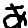
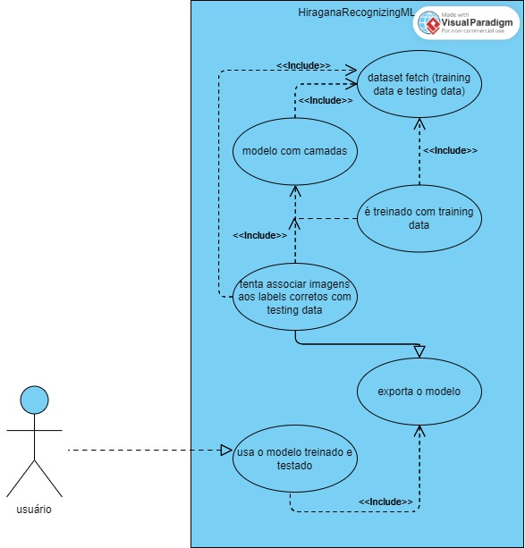
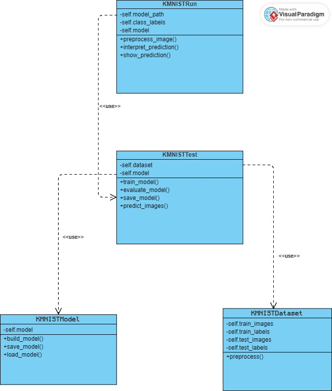

#
<h1>Hiragana predictor TensorFlow</h1>

<h2>O Projeto</h2>
Este é um projeto que visa criar um algorítimo de machine learning para ler e predizer caracteres japoneses do sistema Hiragana de escrita, um dos três comumente utilizados na língua.

O intuito do programa é que ele visualize uma imagem de um caractere escrito à mão e consiga dizer que caractere é esse.

O projeto usa Programação Orientada A Objetos para melhor organização e efetividade do código.

O método de ML utlizado foi uma CNN (Convoluted Neural Network), que usa de várias camadas diferentes, diferentemente de redes densas comuns, que usam primariamente um tipo de camada, todas interconectadas.

<h2>Como utilizar</h2>
primeiro é necessário treinar e testar o modelo, para isso utiliza-se os arquivos "k49-train-imgs" e "k49-train-labels" para treinamento e "k49-test-imgs" e "k49-test-labels" para testes, todos incluso dentro da pasta "assets". Apenas rode o arquivo "test.py" que esses arquivos serão automaticamente buscados pelo programa.
  
Após alguns minutos, o modelo será exportado para o arquivo "hiraga.model.keras", que será utilizado quando formos testar com nossas próprias imagens.
  
Agora precisaremos de nossas próprias imagens, o importante é que elas sejam escritas com tinta preta em papel branco, a imagem deve ser de exatamente 28px por 28px, para que seja possível de rodar o programa até em hardwares menos potentes.
  
Exemplo:
 

##

